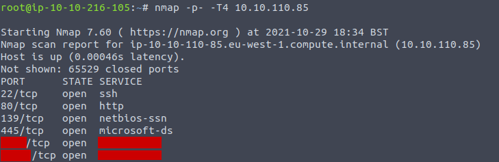
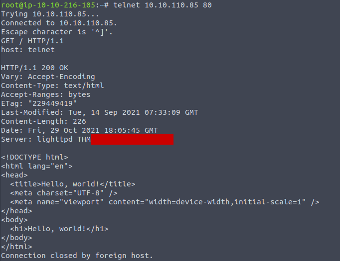
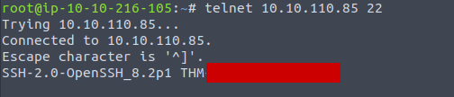
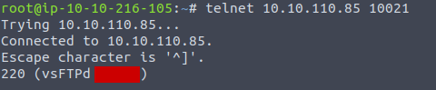
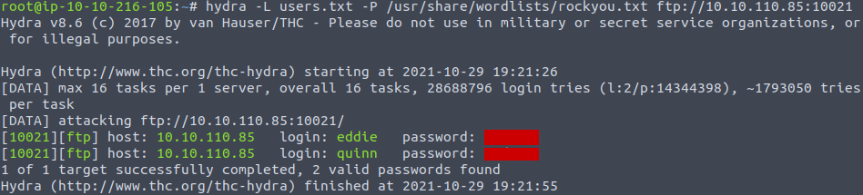
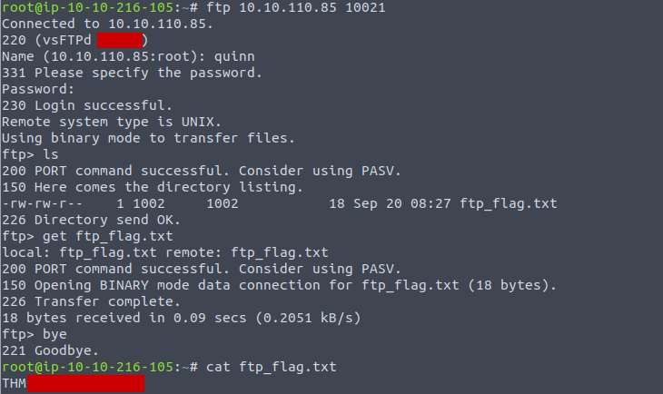
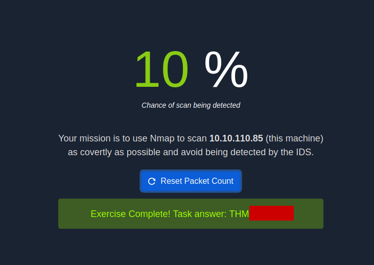

# Net Sec Challenge

Net Sec Challenge is a VIP room on TryHackMe that can help you test your network security skills using Nmap, Telnet, and Hydra.


## Task 1: Introduction
We need to start the target machine and deploy the attack box if we are using a browser to answer the questions.


## Task 2: Challenge Questions  
We are going to use Nmap to scan our target machine for open ports. We need to scan for all the ports to be able to answer the first three questions. As a result, the scan may take several minutes or more.  

```
nmap -p- -T4 MACHINE_IP
```

**-p-:** scans all the ports  
**-T4:** does scanning faster  

The image below contains answers to the first two questions in the task. Also, we can see that there are 6 open TCP ports.  

  

In order to find the flag hidden in the HTTP server header, we need to use Telnet.  

```
telnet MACHINE_IP 80  
```

 

The next question asks us to find the flag hidden in the SSH server header. We need to connect to the SSH port on our target machine.  

```
telnet MACHINE_IP 22  
```

 

To find the version of the FTP server, we are going to run the following command:

```
telnet MACHINE_IP 10021  
```

 

We learned two usernames using social engineering: eddie and quinn. In order to get the flag hidden in one of these two account files, first of all, we need to save these usernames to a file. Then we are going to use Hydra and /usr/share/wordlists/rockyou.txt file to figure out their passwords.

```
hydra -L users.txt -P /usr/share/wordlists/rockyou.txt ftp://MACHINE_IP:10021
```

**-L:** loads several logins from a file  
**-P:** loads several passwords from a file  

 

After getting the passwords, we need to log in using FTP to find the file that contains the flag. Then we are going to download the file to our machine and print out its content.

 

To answer the last question in the challenge we need to visit _http://MACHINE_IP:8080_.  
To reduce the probability of being detected, we are going to run a NULL scan using Nmap. As you might remember, the null scan does not set any flag. And by sending requests which do not include the SYN flag, we can bypass the firewall.  

```
nmap -sN MACHINE_IP  
```

 

I hope this write-up helped you to complete this challenge and refresh your network security skills.