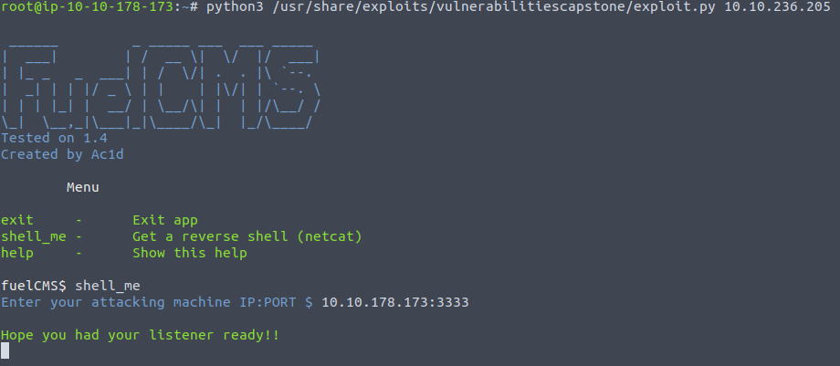

# Vulnerability Capstone

Vulnerability Capstone is a VIP room on TryHackMe that can help you test your skills in vulnerability research.


## Task 1: Introduction
We need to start the target machine and deploy the attack box if we are using a browser to answer the questions.


## Task 2: Exploit the Machine
In order to find out the name and the version number of the application running on the vulnerable machine, we need to navigate to _http://MACHINE_IP_.

  

After finding out the application name and version, we can search for the CVE that allows an attacker to remotely execute code on this application.

One of the options can be [Exploit Database](https://www.exploit-db.com).

Now we need to find the flag located on this vulnerable machine. We are going to use the exploit suggested by TryHackMe.

We need to set up a listener on our attacking machine: 

```
nc -nvlp PORT
```

Then we need to run the exploit.

```
python3 /usr/share/exploits/vulnerabilitiescapstone/exploit.py MACHINE_IP
```

 

 

When you run the command, it will ask you for the attacking machine IP address and the PORT number that you have set up the listener for.